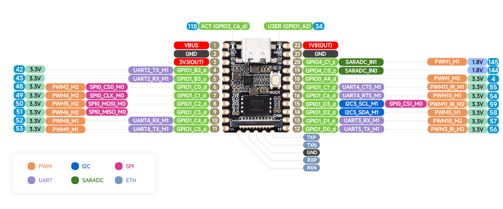
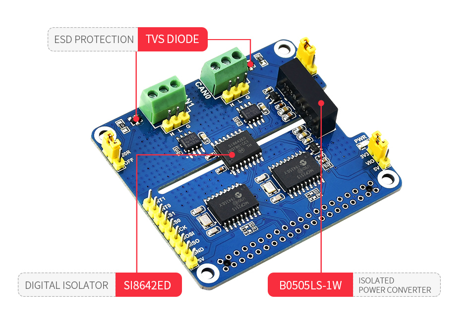

## Add CAN support using mcp25x driver

To add CAN (Controller Area Network) support using Microchip MCP2515, MCP2518fd and similars, first identify your board and available pins.

I'll use Pico mini b board and 2 MCP2515 chips using the [raspberry pi CAN hat](https://www.waveshare.com/2-ch-can-hat.htm).

## CAN HAT ↔ Pico Mini B Pin Mapping

| CAN HAT Board | RK Pin | Pico Mini B |
|:--------------|:------:|:-----------:|
| INT1 | PC6 | GPIO1_C6_d |
| INT0 | PC7 | GPIO1_C7_d |
| CS1  | PD3 | GPIO1_D3_d |
| CS0  | PC0 | GPIO1_C0_d |
| SCK  | PC1 | SPI0_CLK_M0 |
| MOSI | PC2 | SPI0_MOSI_M0 |
| MISO | PC3 | SPI0_MISO_M0 |
| GND  | — | GND |
| 5V   | — | VBUS |

