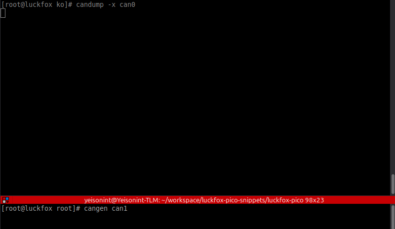
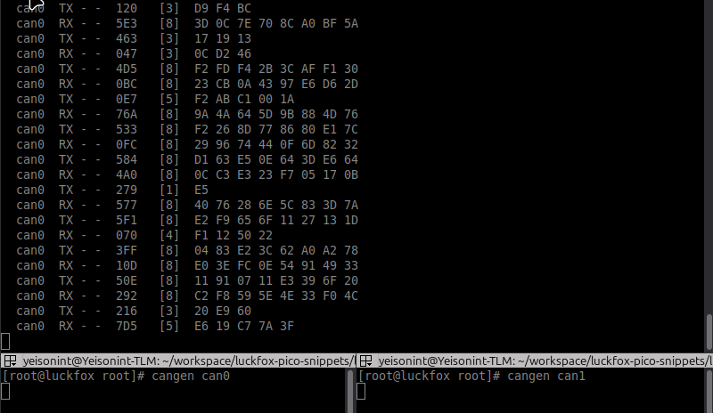
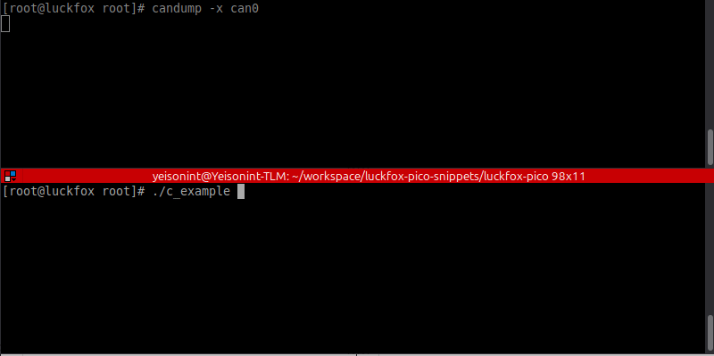

# Add CAN support using MCP25x driver

This guide explains how to add **CAN (Controller Area Network)** support
using Microchip SPI CAN controllers such as **MCP2515** and
**MCP2518FD** on the Luckfox Pico platform.

The process involves: 1. Connecting the CAN controller via SPI\
2. Modifying the **Device Tree (DTS)**\
3. Enabling the CAN driver in the kernel\
4. Installing CAN utilities\
5. Testing the CAN interfaces

------------------------------------------------------------------------

# Hardware setup

First identify your board and available pins.


In this example the **Pico Mini B** board is used together with two
MCP2515 controllers through the following CAN HAT:

https://www.waveshare.com/2-ch-can-hat.htm

**Important:** Modules with **8 MHz crystals did not work reliably with
this driver**. Use MCP2515 modules with a **16 MHz crystal**.

**Important:** If you are using the same Waveshare HAT, move the **VIO
jumper from 5V to 3V3** so the logic level matches the Pico board.


------------------------------------------------------------------------

# CAN HAT ↔ Pico Mini B Pin Mapping

The MCP2515 controllers communicate with the SoC using **SPI0** and two
interrupt lines.

| CAN HAT Board | RK Pin | Pico Mini B |
|:--------------|:------:|:-----------:|
| INT1 | PC6 | GPIO1_C6_d |
| INT0 | PC7 | GPIO1_C7_d |
| CS1  | PD3 | GPIO1_D3_d |
| CS0  | PC0 | GPIO1_C0_d |
| SCK  | PC1 | SPI0_CLK_M0 |
| MOSI | PC2 | SPI0_MOSI_M0 |
| MISO | PC3 | SPI0_MISO_M0 |
| GND  | — | GND |
| 5V   | — | VBUS |
------------------------------------------------------------------------

# Modify the Device Tree (DTS)

The Device Tree files are located in:

    ../luckfox-pico/sysdrv/source/kernel/arch/arm/boot/dts

## 1. Enable SPI

Open the board DTS file:

    rv1103g-luckfox-pico-mini.dts

Enable the SPI0 controller:

    /**********SPI**********/
    /* SPI0_M0 */
    &spi0 {
        status = "okay";
    };

------------------------------------------------------------------------

## 2. Add MCP2515 configuration

Open:

    rv1103-luckfox-pico-ipc.dtsi

### Add a fixed clock

The MCP2515 requires a clock definition in the Device Tree.\
Add the following node inside the root node (`/`):

    clk_mcp2515: clk_mcp2515 {
        compatible = "fixed-clock";
        #clock-cells = <0>;
        clock-frequency = <16000000>;
    };

------------------------------------------------------------------------

## 3. Configure SPI devices

Enable the SPI controller and declare the MCP2515 devices:

    /***************************** PINCTRL ********************************/
    // SPI
    &spi0 {
        status = "okay";
        num-cs = <2>;
        #address-cells = <1>;
        #size-cells = <0>;
        pinctrl-names = "default";
        pinctrl-0 = <&spi0m0_clk 
                 &spi0m0_miso 
                 &spi0m0_mosi
                 &spi0_cs_pins
                 &mcp2515_int0_pin
                 &mcp2515_int1_pin>;
        
        cs-gpios = <&gpio1 RK_PC0 GPIO_ACTIVE_LOW>,
                <&gpio1 RK_PD3 GPIO_ACTIVE_LOW>;

        /* MCP2515 #1 */
        can0: mcp2515@0 {
            compatible = "microchip,mcp2515";
            reg = <0>;
            spi-max-frequency = <10000000>;

            clocks = <&clk_mcp2515>;
            clock-names = "mcp2515";

            interrupt-parent = <&gpio1>;
            interrupts = <RK_PC6 IRQ_TYPE_LEVEL_LOW>;
        };

        /* MCP2515 #2 */
        can1: mcp2515@1 {
            compatible = "microchip,mcp2515";
            reg = <1>;
            spi-max-frequency = <10000000>;

            clocks = <&clk_mcp2515>;
            clock-names = "mcp2515";

            interrupt-parent = <&gpio1>;
            interrupts = <RK_PC7 IRQ_TYPE_LEVEL_LOW>;
        };
    };

------------------------------------------------------------------------

## 4. Add pinctrl configuration

Add the SPI pins, chip select pins, and interrupt pins:

    &pinctrl {
        spi0 {
            spi0m0_clk: spi0m0-clk {
                rockchip,pins = <1 RK_PC1 4 &pcfg_pull_none>;
            };
            spi0m0_mosi: spi0m0-mosi {
                rockchip,pins = <1 RK_PC2 6 &pcfg_pull_none>;
            };
            spi0m0_miso: spi0m0-miso {
                rockchip,pins = <1 RK_PC3 6 &pcfg_pull_none>;
            };
            spi0_cs_pins: spi0-cs-pins {
                rockchip,pins = <1 RK_PC0 RK_FUNC_GPIO &pcfg_pull_up>,
                                <1 RK_PD3 RK_FUNC_GPIO &pcfg_pull_up>;
            };

            mcp2515_int0_pin: mcp2515-int0-pin {
                rockchip,pins = <1 RK_PC6 RK_FUNC_GPIO &pcfg_pull_up>;
            };

            mcp2515_int1_pin: mcp2515-int1-pin {
                rockchip,pins = <1 RK_PC7 RK_FUNC_GPIO &pcfg_pull_up>;
            };
        };
    };

### Why use GPIO CS instead of SPI CS?

The default SPI chip select pins (`SPI0_CS0_M0`, `SPI0_CS1_M0`) caused
unstable behavior with two MCP2515 devices.

After a few messages the kernel reported an SPI failure and disconnected
one of the controllers. Using **GPIO-based CS lines** avoids this issue.

------------------------------------------------------------------------

# Enable the CAN driver

Go to the SDK root directory:

    ../luckfox-pico

Run:

``` bash
./build.sh kernelconfig
```

Enable:

    Networking support
     └── CAN bus subsystem support
         └── CAN Device Drivers
             └── CAN SPI interfaces
                 └── Microchip MCP251x and MCP25625 SPI CAN controllers

Enable it as a **module (M)**.

Build the kernel:

``` bash
./build.sh kernel
```

------------------------------------------------------------------------

# Install CAN utilities

Go to the SDK root directory:

    ../luckfox-pico

Open Buildroot configuration:

``` bash
./build.sh buildrootconfig
```

Enable:

    Target packages
     └── Networking applications
         ├── can-utils
         └── iproute2

Build the root filesystem:

``` bash
./build.sh rootfs
```

Or rebuild everything:

``` bash
./build.sh all
```

------------------------------------------------------------------------

# Flash the board

Go to the SDK root directory:

    ../luckfox-pico

Connect the board in **bootloader mode** and run:

``` bash
sudo ./rkflash.sh update
```

------------------------------------------------------------------------

# Connect to the board

Example:

``` bash
ssh root@172.32.0.93
```

------------------------------------------------------------------------

# Load the CAN driver

On the board:

``` bash
cd /oem/usr/ko/
insmod mcp251x.ko
```

Check logs:

``` bash
dmesg | grep can
```

Expected:

    mcp251x spi0.0 can0: MCP2515 successfully initialized.
    mcp251x spi0.1 can1: MCP2515 successfully initialized.

------------------------------------------------------------------------

# Test the CAN interfaces

Connect:

    CAN0_H ↔ CAN1_H
    CAN0_L ↔ CAN1_L

Bring interfaces up:

``` bash
ip link set can0 up type can bitrate 500000 restart-ms 100
ip link set can1 up type can bitrate 500000 restart-ms 100
```

Monitor traffic:

``` bash
candump -x can0
```

Send frames:

``` bash
cangen can1
```



You can also try sending messages on two terminals.



------------------------------------------------------------------------

# Basic C example

This is a multithreaded SocketCAN example in C that sends and receives CAN frames using two interfaces (default can1 for TX and can0 for RX).

It creates two threads:

* TX thread: generates a random CAN frame every 2 seconds and sends it through the TX interface.
* RX thread: continuously reads frames from the RX interface.

Both threads push events (TX or RX) into a thread-safe circular queue protected by a mutex and condition variable. The main thread waits for events from the queue and prints the frame information (ID, DLC, and data). The example uses SocketCAN (PF_CAN), POSIX threads, and a signal handler to allow a clean shutdown when receiving SIGINT or SIGTERM.

Build:

``` bash
cd c_example
mkdir build
cd build
cmake ..
make
```

Send to board:

``` bash
scp ./c_example root@172.32.0.93:/root
```

Run:

Terminal 1:

``` bash
candump -x can0
```

Terminal 2:

``` bash
./c_example
```

